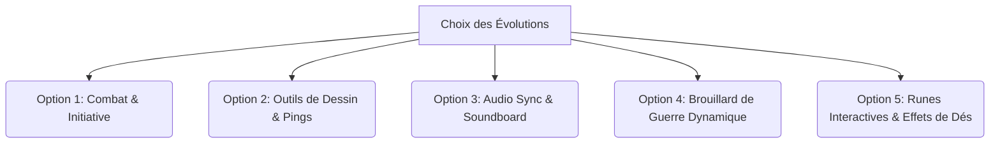

# Rapport de Proposition : Prochaines Évolutions de Signet VTT

Suite aux récentes optimisations majeures (dédoublonnement des composants, centralisation de la synchronisation via `BroadcastChannel` et consolidation des transferts d'assets P2P), l'architecture de **Signet VTT** est dorénavant ultra-robuste. 

Pour propulser l'application à l'étape supérieure, voici un rapport de proposition très détaillé présentant **5 orientations majeures**. Chaque option est documentée avec son concept, son design d'interface, ses prérequis de base de données, son protocole réseau P2P et ses spécifications PixiJS 8.

---



---

## ⚔️ Option 1 : Tracker d'Initiative et Gestion des Combats
*La colonne vertébrale des sessions de jeu de rôle tactiques.*

### 1. Concept & Fonctionnalités
Permettre au MJ de lancer et gérer un combat en ordonnant les personnages (joueurs et monstres) selon leur score d'initiative.
*   **Lancement d'Initiative** : Calcul automatique ou manuel pour tous les acteurs présents sur la carte.
*   **Suivi des Tours** : Surbrillance du personnage actif et boutons "Fin de tour".
*   **Indicateurs Rapides** : PV, CA (Classe d'Armure) et statuts/conditions directement modifiables depuis le tracker.
*   **Synchronisation Globale** : Tout le monde voit la file d'attente se mettre à jour en temps réel.

### 2. Design de l'Interface (Aesthetic Alchemy)
*   **Fenêtre Flottante** (`InitiativeWindowContent.tsx`) : 
    *   Style *glassmorphic* premium (`bg-[#0D0D0F]/90 backdrop-blur-2xl`) avec bordures dorées de type "Jarvis".
    *   Liste verticale des combattants animée avec des transitions fluides lors des changements de tours.
    *   L'acteur dont c'est le tour s'illumine d'un halo doré pulsant (`animate-rune-pulse` sur fond de dégradé d'or).
    *   Indicateur de PV interactif : jauge de type "verre liquide" (`liquid-glass-fill` verte/rouge).

### 3. Architecture Technique & Sync
*   **Base de Données** : Ajout d'une table dans [ipc-handlers.ts](file:///c:/Users/geekr/Desktop/projet/vtt/sigil-vtt/electron/ipc-handlers.ts) :
    ```sql
    CREATE TABLE IF NOT EXISTS combat_actors (
      id TEXT PRIMARY KEY,
      session_id TEXT,
      character_id TEXT NOT NULL,
      initiative INTEGER DEFAULT 0,
      turn_order INTEGER DEFAULT 0,
      is_active INTEGER DEFAULT 0,
      conditions TEXT DEFAULT '[]'
    );
    ```
*   **Zustand Store** : Création de `src/store/combat.ts` utilisant `setupStoreSync` pour la réplication inter-fenêtres.
*   **Protocole P2P** : Messages échangés par [peer.service.ts](file:///c:/Users/geekr/Desktop/projet/vtt/sigil-vtt/src/services/peer.service.ts) :
    *   `COMBAT_START` : Initialise le combat.
    *   `COMBAT_TURN_CHANGE` : Indique le nouvel index de tour actif.
    *   `COMBAT_ACTOR_UPDATE` : Met à jour les PV/status d'un acteur.
*   **Visualisation PixiJS 8** : Dans [BoardScene.ts](file:///c:/Users/geekr/Desktop/projet/vtt/sigil-vtt/src/pixi/BoardScene.ts), ajout d'un conteneur graphique d'effet (`glowing ring`) sous le sprite du token actif.

---

## 🎨 Option 2 : Outils de Dessin et Pointeurs Temporaires (Map Pings)
*Pour fluidifier la communication tactique autour de la table.*

### 1. Concept & Fonctionnalités
Permettre aux joueurs et au MJ de dessiner directement sur la carte et de signaler des points d'intérêt à la volée.
*   **Pointeur Magique (Ping)** : Clic long ou touche raccourci générant un cercle d'énergie coloré et pulsant à l'endroit désigné, visible par tous les joueurs instantanément.
*   **Outil de Dessin** : Pinceau à main levée, formes géométriques de base (cercles, rectangles) pour matéraitliser les zones d'effet (sortilèges, obstacles).
*   **Règle de Mesure** : Tracé dynamique d'une ligne graduée calculant la distance en mètres/cases selon l'échelle de la grille.

### 2. Design de l'Interface
*   **Barre d'Outils Flottante** (`DrawingToolbar.tsx`) : 
    *   Fine bande verticale fixée sur le bord gauche du `BoardCanvas`.
    *   Boutons ultra-minimalistes avec effet holographique lors du survol.
    *   Sélecteur de couleur circulaire avec des nuances thématiques (Rouge Rubis, Bleu Saphir, Vert Émeraude, Jaune Or).

### 3. Architecture Technique & Sync
*   **Visualisation PixiJS 8** :
    *   Ajout d'un conteneur `drawLayer` entre la grille et les tokens.
    *   Utilisation de la nouvelle API fluent de `Graphics` (ex. `beginFill` -> `fill({ color })`) pour générer les tracés locaux.
*   **Protocole P2P** :
    *   `MAP_PING` : Payload `{ x, y, color, playerId }` pour instancier un ping temporaire de 3 secondes avec auto-destruction via le ticker PixiJS.
    *   `DRAW_VECTOR` : Envoi en temps réel des points constituant le tracé lors du drag, optimisé via l'utilitaire `throttle`.
    *   `DRAW_CLEAR` : Commande globale envoyée par le MJ pour vider le `drawLayer`.
*   **Persistance** : Les dessins persistants du MJ sont sérialisés au format JSON et stockés dans la table `maps` de la base SQL locale.

---

## 🎵 Option 3 : Ambiance Sonore et Audio Sync
*La touche ultime pour l'immersion narrative.*

### 1. Concept & Fonctionnalités
Donner au MJ le contrôle de la bande sonore de la partie, avec synchronisation complète de la lecture chez tous les joueurs.
*   **Lecteur Multi-Source** : Support de fichiers audio importés localement (format MP3/OGG) ou de flux externes.
*   **Ambiance vs Soundboard** : Deux canaux distincts. L'un pour la musique d'ambiance en boucle (ex. "Taverne tranquille", "Combat épique"), l'autre pour les effets sonores instantanés (ex. "Grincement de porte", "Explosion de boule de feu").
*   **Synchronisation P2P Temps Réel** : Alignement de la tête de lecture à la seconde près.

### 2. Design de l'Interface
*   **Codex Audio** (`AudioWindowContent.tsx`) :
    *   Interface inspirée des panneaux de contrôle audio classiques mélangée à la charte alchimique de Signet.
    *   Visualiseur d'onde audio stylisé en SVG (`feTurbulence`) réagissant subtilement au volume.
    *   Boutons de Soundboard présentés sous forme de "runes" cliquables qui clignotent lorsqu'elles sont activées.

### 3. Architecture Technique & Sync
*   **Base de Données** :
    ```sql
    CREATE TABLE IF NOT EXISTS audio_tracks (
      id TEXT PRIMARY KEY,
      session_id TEXT,
      name TEXT NOT NULL,
      url TEXT,
      category TEXT DEFAULT 'ambient',
      local_path TEXT
    );
    ```
*   **Audio Pipeline** : Utilisation de l'API HTML5 `AudioContext` pour un contrôle précis des volumes croisés (*crossfade*) et des gains.
*   **P2P & Transferts** :
    *   *Musiques locales* : Chunks diffusés via le canal de données rapides `transferConn` (déjà rodé pour les portraits de monstres) puis reconstitués dans l'IndexedDB des joueurs avant lecture.
    *   *Commandes de contrôle* : Envoi de messages `AUDIO_PLAY`, `AUDIO_PAUSE`, `AUDIO_SEEK` avec un timestamp réseau pour compenser la latence et démarrer la lecture exactement au même moment chez tout le monde.

---

## 🌫️ Option 4 : Brouillard de Guerre Dynamique (Fog of War)
*Indispensable pour maintenir le mystère et l'exploration des donjons.*

### 1. Concept & Fonctionnalités
Masquer les parties non explorées de la carte aux yeux des joueurs, et dévoiler l'environnement à mesure qu'ils déplacent leurs figurines.
*   **Brouillard Manuel** : Le MJ dispose d'un pinceau pour gommer le brouillard noir ou masquer à nouveau des zones de la carte.
*   **Brouillard Dynamique par Ligne de Vue** : Calcul automatique de la zone de vision autour de chaque figurine de joueur en tenant compte des obstacles (murs) définis par le MJ.

### 2. Design de l'Interface
*   **Commandes de Révélation** :
    *   Mode pinceau avec curseur circulaire texturé projetant un effet de "halo lumineux" lors de la découpe.
    *   Transition du brouillard animée avec des fondus doux pour éviter les coupures brutes.

### 3. Architecture Technique & Sync
*   **PixiJS 8 Engine** :
    *   Utilisation d'un calque `FogOfWar` avec une `RenderTexture`.
    *   On applique un masque sombre (`alpha = 0.85`) et on utilise le blendMode `'erase'` pour "creuser" les zones visibles par les joueurs.
*   **Protocole Réseau P2P** :
    *   Pour le brouillard manuel : La grille de masque est stockée sous forme de matrice compressée (tableau binaire converti en Base64). Lors des modifications, le MJ diffuse la matrice mise à jour via `FOW_GRID_SYNC`.
    *   Pour le brouillard dynamique : Seules les coordonnées des tokens joueurs sont transmises (déjà en place). Chaque client calcule sa propre ligne de vue locale en s'appuyant sur les données de polygones de collisions des murs partagées en début de scène.

---

## 🌀 Option 5 : Runes Tactiques et Effets Visuels de Dés
*Une exclusivité visuelle pour magnifier le plateau de jeu.*

### 1. Concept & Fonctionnalités
Rendre le plateau PixiJS vivant en ajoutant des micro-interactions visuelles d'ambiance et des jets de dés en 3D simulés sur le canvas.
*   **Runes de Sorts** : Quand un joueur utilise une compétence (depuis sa fiche), le token concerné dessine au sol un cercle de rune magique brillant pendant 2 secondes.
*   **Physique des Dés sur Canvas** : Les lancers de dés ne s'affichent pas uniquement dans le chat, mais projettent des dés physiques rebondissant sur la carte en poussant les tokens sur leur passage avant de se stabiliser.

### 2. Design de l'Interface
*   **Rendu Visuel** :
    *   Explosion de particules colorées lors des réussites critiques.
    *   Runes lumineuses dessinées de façon procédurale avec des ombrages portés (`drop-shadow-glow`).

### 3. Architecture Technique & Sync
*   **PixiJS 8 Engine** :
    *   Utilisation d'un système de particules légères intégré à la boucle du Ticker Pixi.
    *   Les modèles de dés utilisent des sprites 2.5D pré-calculés tournant sur eux-mêmes, minimisant la consommation GPU de la machine.
*   **Sync Réseau** :
    *   `DICE_THROW_PHYSICS` : Envoie la graine aléatoire (*seed*) et l'angle initial pour que la trajectoire des dés soit reproduite à l'identique et de manière déterministe sur les écrans de tous les joueurs.

---

## 💡 Tableau Comparatif des Efforts et Impacts

| Option | Complexité Technique | Impact Immersion | Charge Réseau / CPU | Priorité Suggérée |
| :--- | :--- | :--- | :--- | :--- |
| **1. Tracker d'Initiative** | ⚡⚡ (Moyenne) | ⭐⭐⭐⭐ (Très Haut) | 🟢 Négligeable | **P1 (Indispensable)** |
| **2. Outils de Dessin & Pings** | ⚡⚡⚡ (Haute) | ⭐⭐⭐⭐ (Très Haut) | 🟡 Modérée (mouvements) | **P2 (Excellent confort)** |
| **3. Ambiance Audio Sync** | ⚡⚡⚡⚡ (Très Haute)| ⭐⭐⭐⭐⭐ (Maximum) | 🔴 Élevée (fichiers MP3)| **P4 (Option secondaire)** |
| **4. Brouillard de Guerre** | ⚡⚡⚡⚡ (Très Haute)| ⭐⭐⭐⭐⭐ (Maximum) | 🟡 Modérée (matrices) | **P3 (Excellente exploration)**|
| **5. Runes & Dés Physiques**| ⚡⚡⚡ (Haute) | ⭐⭐⭐⭐ (Très Haut) | 🟢 Négligeable | **P5 (Cosmétique)** |

---

> [!TIP]
> **Quelle direction souhaites-tu explorer pour le prochain cycle ?**
> Fais-moi part de ton choix ou des ajustements que tu aimerais apporter à ces concepts. Une fois validé, je créerai le plan d'implémentation détaillé (`implementation_plan.md`) ainsi que la liste des tâches associées (`task.md`) pour démarrer le développement !