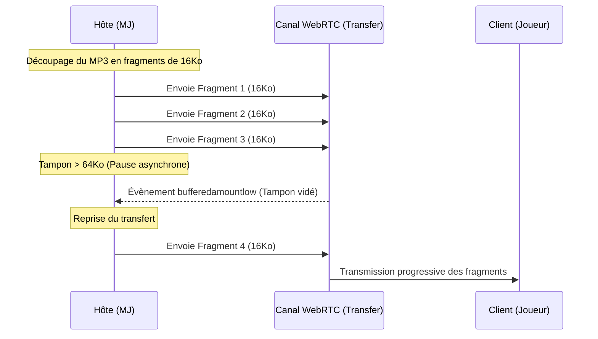

# Rapport de Réflexion : Synchronisation Audio & Optimisation Réseau (Option 3)

Ce document présente une étude approfondie sur la mise en œuvre de l'**Ambiance Sonore et de l'Audio Sync** au sein de **Signet VTT**, en se concentrant sur l'utilisation de **Howler.js** et sur les techniques permettant de **laisser respirer le réseau** lors des transferts de fichiers volumineux (MP3/OGG).

---

## 1. La Problématique : Pourquoi l'audio sature-t-il le P2P ?

Contrairement aux chunks d'images de cartes (WebP de 512x512 pixels pesant entre 10 et 50 Ko), un fichier audio d'ambiance (MP3/OGG) est un bloc monolithique pesant généralement **entre 2 Mo et 15 Mo**.

Si nous utilisons la méthode de transfert actuelle dans [transfer.service.ts](file:///c:/Users/geekr/Desktop/projet/vtt/sigil-vtt/src/services/transfer.service.ts), qui fragmente le fichier et l'envoie via une boucle synchrone `for` classique :
1.  Le tampon réseau WebRTC (`bufferedAmount`) sature instantanément.
2.  La file d'attente WebRTC déborde, provoquant des latences extrêmes sur les paquets critiques (mouvements de jetons, chat, jets de dés).
3.  Dans le pire des cas, la connexion P2P de PeerJS s'effondre en raison d'une congestion réseau (time-out).

---

## 2. La Solution Technique : Le Pacing par régulation du `bufferedAmount`

Pour laisser respirer le réseau, nous devons implémenter un **mécanisme de régulation asynchrone (Pacing)** basé sur le niveau de remplissage du canal de données WebRTC.

### Comment fonctionne le Pacing ?
WebRTC fournit une propriété `bufferedAmount` sur l'objet `RTCDataChannel`. Elle indique le nombre d'octets de données actuellement mis en file d'attente pour envoi.
L'idée est de **suspendre** l'envoi des fragments d'audio si le tampon dépasse une certaine limite (ex. 64 Ko), et d'attendre l'évènement `bufferedamountlow` pour reprendre le transfert.



### Prototype du Transfert Audio Régulé
Voici comment nous pourrions adapter notre service de transfert pour gérer l'envoi asynchrone de l'audio :

```typescript
// Exemple de fonction d'envoi rythmé (Pacing)
public async sendAudioChunks(trackId: string, data: ArrayBuffer, targetPeerId?: string) {
  const CHUNK_SIZE = 16 * 1024; // 16KB
  const totalFrags = Math.ceil(data.byteLength / CHUNK_SIZE);
  
  // Accès au canal brut WebRTC depuis PeerJS
  const connection = peerService.connections.get(targetPeerId || '');
  const dataChannel = connection?.transfer?.dataChannel; // RTCDataChannel sous-jacent

  const BUFFER_LIMIT = 64 * 1024; // Limite de 64 Ko pour ne pas saturer

  for (let i = 0; i < totalFrags; i++) {
    const start = i * CHUNK_SIZE;
    const end = Math.min(start + CHUNK_SIZE, data.byteLength);
    const fragData = data.slice(start, end);

    // Si le canal WebRTC est trop chargé, on attend
    if (dataChannel && dataChannel.bufferedAmount > BUFFER_LIMIT) {
      await new Promise<void>((resolve) => {
        const checkBuffer = () => {
          if (dataChannel.bufferedAmount <= BUFFER_LIMIT) {
            resolve();
          } else {
            // Raccourci ou attente de l'évènement WebRTC
            dataChannel.onbufferedamountlow = () => {
              dataChannel.onbufferedamountlow = null;
              resolve();
            };
          }
        };
        checkBuffer();
      });
    }

    // Préparation et envoi du payload (identique au format FragmentHeader existant)
    const payload = this.preparePayload(trackId, i, totalFrags, fragData);
    
    if (targetPeerId) {
      peerService.sendTransferTo(targetPeerId, payload);
    } else {
      peerService.broadcastTransfer(payload);
    }

    // Ajout d'une micro-pause artificielle (ex: 5ms) pour libérer l'Event Loop JS
    await new Promise(resolve => setTimeout(resolve, 5));
  }
}
```

---

## 3. Stratégie d'Hydratation & Cache (IndexedDB)

Pour minimiser drastiquement le trafic réseau, nous devons réutiliser le système éprouvé de `dbStorage` (IndexedDB) utilisé pour les images :

1.  **Hachage unique** : Chaque fichier audio importé par le MJ reçoit un hash SHA-256 unique.
2.  **Vérification de Cache locale** : Lorsqu'un morceau doit être joué, le MJ envoie uniquement le message de contrôle `AUDIO_PLAY` avec le `{ hash, title }`.
3.  **Cas 1 : Cache Hit (Idéal)** : Le joueur possède déjà le fichier dans son IndexedDB. Il instancie immédiatement un Blob URL et lance la lecture sans solliciter le réseau.
4.  **Cas 2 : Cache Miss** : Le joueur ne l'a pas. Il envoie une requête `AUDIO_REQUEST` au MJ. Le MJ lui envoie le fichier de manière asynchrone (Pacing). La musique commence à jouer dès la fin de l'assemblage et est sauvegardée pour les prochaines sessions.

---

## 4. Intégration de Howler.js pour le Rendu Audio

**Howler.js** est la bibliothèque idéale pour Signet VTT car elle simplifie la gestion de l'Audio Web :

*   **Rendu à partir de Blobs** : Howler accepte directement les URLs d'objets Blob créées depuis IndexedDB :
    ```typescript
    const blob = new Blob([audioData], { type: 'audio/mp3' });
    const blobUrl = URL.createObjectURL(blob);

    const sound = new Howl({
      src: [blobUrl],
      format: ['mp3'],
      html5: true // Permet le streaming progressif et évite de saturer la RAM
    });
    ```
*   **Gestion des canaux (Ambiance vs Effets)** :
    *   **Canal Ambiance (Musique)** : Lecture en boucle (`loop: true`), avec transition en fondu croisé (*crossfade*) de 2 secondes lors du changement de piste pour un rendu haut de gamme.
    *   **Canal Soundboard (Bruits rapides)** : Lecture instantanée (`loop: false`), volumes superposables sans coupure de la musique.
*   **Gestion de la latence de synchronisation** :
    Lorsqu'une musique démarre, le MJ envoie un message : `{ type: 'AUDIO_PLAY', payload: { hash, startTime: Date.now() } }`. 
    Le client calcule le décalage : `latence = Date.now() - startTime`. Il lance alors la lecture au point exact : `sound.seek(latence / 1000)`. La synchronisation est parfaite.

---

## 5. Pré-chargement Silencieux (Background Preloading)

Pour éviter les chargements de dernière minute lors des moments critiques (ex: début d'un combat), le MJ peut déclencher des **pré-chargements en tâche de fond** :

*   Lors de la préparation d'une scène, le MJ envoie une liste de morceaux associés à la zone (ex: Musique de combat de la crypte).
*   Les clients vérifient leur cache et téléchargent silencieusement les morceaux manquants pendant que les joueurs explorent.
*   Le pacing de ces pré-chargements est configuré pour être encore plus lent et discret (ex: 20ms de pause entre les chunks) afin de laisser 100 % de bande passante aux déplacements de jetons et aux communications.

---

> [!TIP]
> **Que penses-tu de cette approche de pacing par `bufferedAmount` ?**
> Si cela te convient, nous pourrons étendre [transfer.service.ts](file:///c:/Users/geekr\Desktop/projet/vtt/sigil-vtt/src/services/transfer.service.ts) pour intégrer cette méthode asynchrone régulée lors du développement de l'Option 3.
